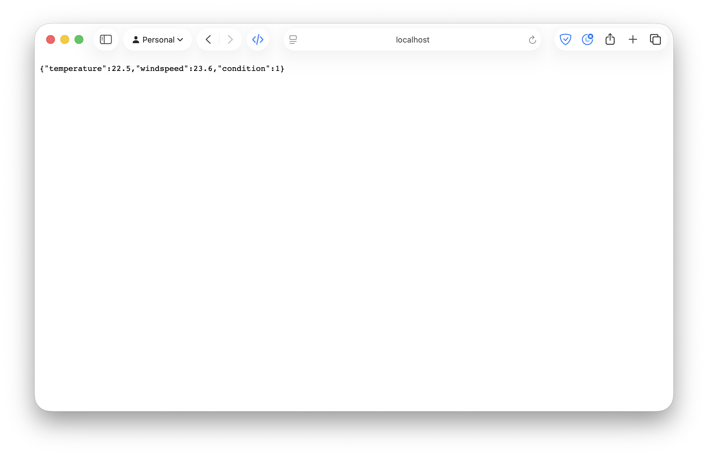
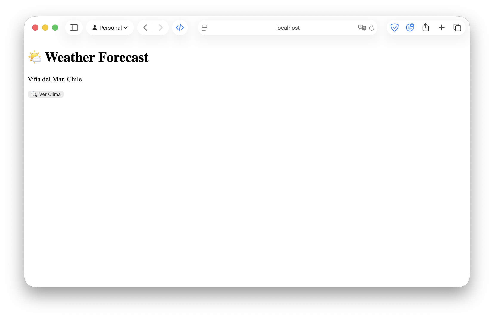
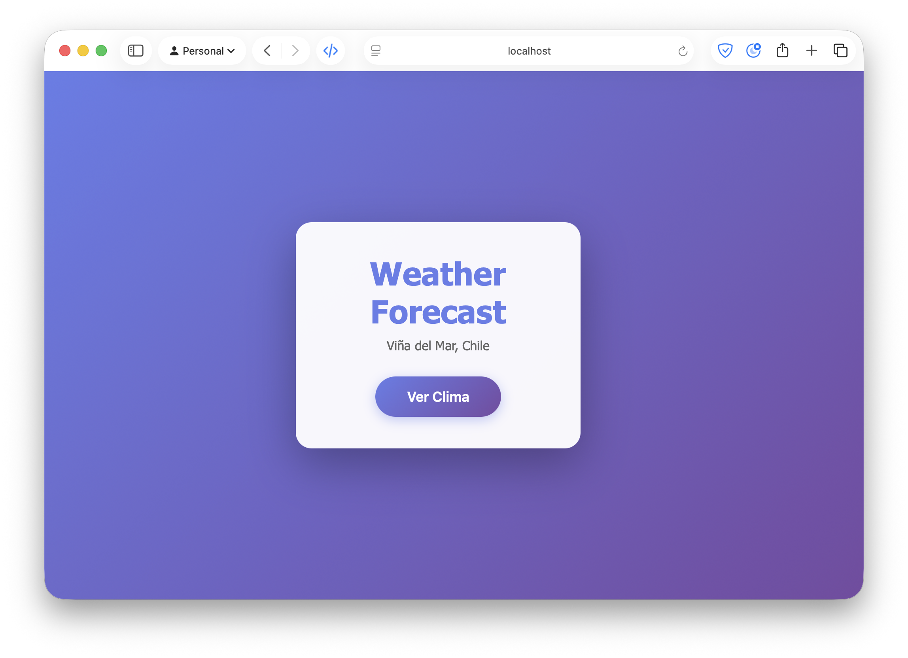
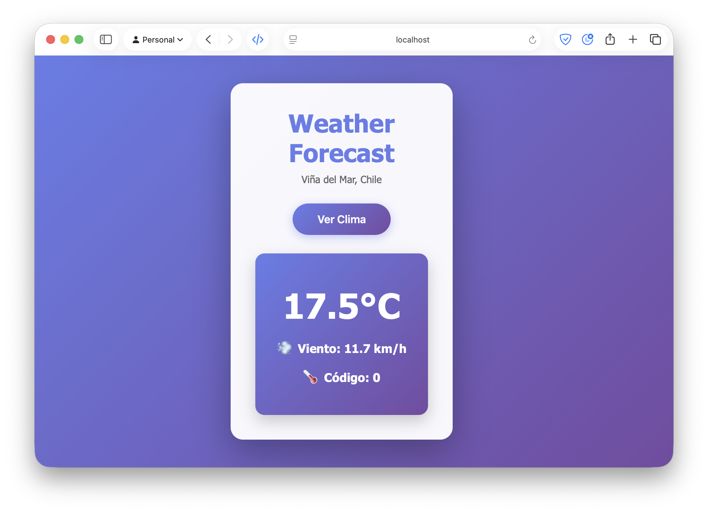
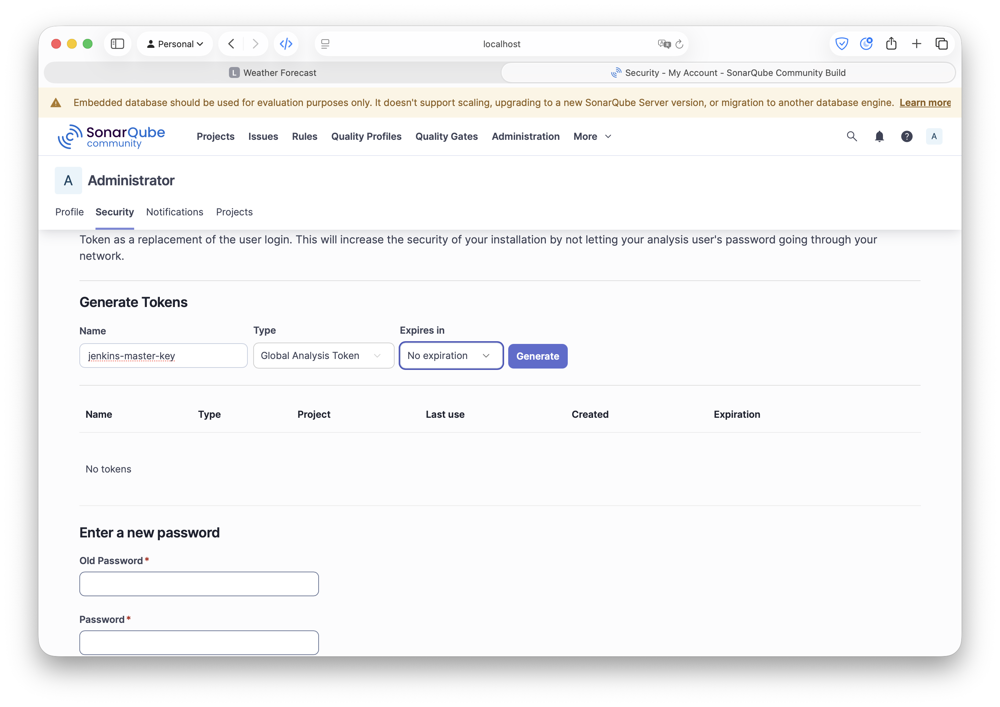
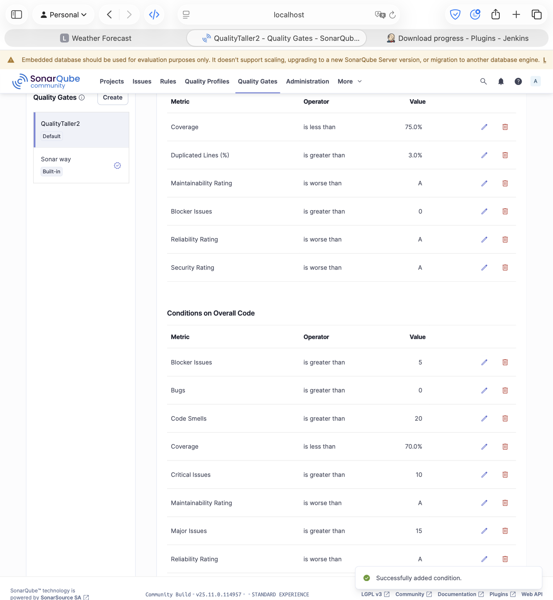

# Taller 2
Integración Continua con Jenkins, Análisis de Código con SonarQube y Contenerización con Docker

Este taller tiene como objetivo implementar un flujo de integración continua utilizando Jenkins, realizar análisis de calidad de código con SonarQube y contenerizar una aplicación web sencilla utilizando Docker.

## Estructura del Proyecto
### Servicios
1. **Frontend**: Un servidor Nginx que sirve una aplicación web construida con React y Vite que permite a los usuarios consultar el clima de solo Viña del Mar.

2. **Backend**: Un servicio API construido con Node.js y Express que se comunica con la API pública de Open-Meteo para obtener datos climáticos de Viña del Mar.

3. **Jenkins**: Orquestador del pipeline CI/CD que ejecuta pruebas, análisis de código y despliegue.

4. **SonarQube**: Herramienta para el análisis de calidad y seguridad del código.

### Redes
- **Docker Network**: Una red Docker llamada `weather-net` que conecta todos los servicios.

### Volúmenes
- **SonarQube Data**: Un volumen persistente para almacenar los datos de SonarQube.
- **SonarQube Extensions**: Un volumen persistente para almacenar los plugins de SonarQube.
- **SonarQube Logs**: Un volumen persistente para almacenar los logs de SonarQube.
- **Jenkins Home**: Un volumen persistente para almacenar la configuración y datos de Jenkins.

## Desarrollo del Proyecto
### Requisitos Previos
- Docker y Docker Compose instalados.

### Desarrollar la API Backend sencilla en JavaScript
````javascript
// backend/index.js
const express = require('express');
const axios = require('axios');
const cors = require('cors');
const app = express();

app.use(cors());

// Endpoint principal
app.get('/api/weather', async (req, res) => {
    const { lat, lon } = req.query;
    
    if (!lat || !lon) {
        return res.status(400).json({ error: 'Latitud y Longitud requeridas' });
    }

    try {
        // Consumimos la API pública de Open-Meteo
        const response = await axios.get(`https://api.open-meteo.com/v1/forecast?latitude=${lat}&longitude=${lon}&current_weather=true`);
        res.json({
            temperature: response.data.current_weather.temperature,
            windspeed: response.data.current_weather.windspeed,
            condition: response.data.current_weather.weathercode
        });
    } catch (error) {
        console.error('Error consultando servicio externo:', error.message);
        res.status(500).json({ 
            error: 'Error consultando servicio externo',
            details: error.message 
        });
    }
});

const PORT = process.env.PORT || 3001;
// Exportamos server para testing
const server = app.listen(PORT, () => {
    console.log(`Backend corriendo en puerto ${PORT}`);
});

module.exports = server;
````

Crear el archivo package.json para el backend.

````json
//backend/package.json
```json
{
  "name": "weatherforecast-backend",
  "version": "1.0.0",
  "main": "index.js",
  "scripts": {
    "start": "node index.js",
    "test": "jest --coverage"
  },
  "dependencies": {
    "axios": "^1.6.0",
    "cors": "^2.8.5",
    "express": "^4.18.2"
  },
  "devDependencies": {
    "jest": "^29.7.0",
    "supertest": "^6.3.3"
  }
}
````

Lo que nos da la API corriendo en la dirección `http://localhost:3001/api/weather?lat=-33.03&lon=-71.55`

<!-- Se adjunta foto de la carpeta /media/api.png  -->


## Desarrollo de Frontend sencillo en React y Vite
````javascript
// frontend/src/App.jsx
import React, { useState } from 'react';
import './App.css';

function App() {
  const [weather, setWeather] = useState(null);
  const [error, setError] = useState(null);
  const [loading, setLoading] = useState(false);

  const fetchWeather = async () => {
    setLoading(true);
    setError(null);
    try {
        // Coordenadas fijas para Viña del Mar, Chile
      const res = await fetch('http://localhost:3001/api/weather?lat=-33.02&lon=-71.55');
      const data = await res.json();
      if (data.error) {
        setError(data.error);
      } else {
        setWeather(data);
      }
    } catch (e) {
      setError('Error al conectar con el servidor');
      console.error(e);
    } finally {
      setLoading(false);
    }
  };

  return (
    <div className="app">
      <h1>Weather Forecast</h1>
      <p className="subtitle">Viña del Mar, Chile</p>
      
      <button onClick={fetchWeather} disabled={loading}>
        {loading ? 'Cargando...' : 'Ver Clima'}
      </button>
      
      {error && (
        <div className="error">
          ⚠️ {error}
        </div>
      )}
      
      {weather && (
        <div className="weather-info">
          <div className="weather-card">
            <div className="temperature">
              {weather.temperature}°C
            </div>
            <div className="weather-detail">
              <span className="icon">💨</span>
              <span>Viento: {weather.windspeed} km/h</span>
            </div>
            <div className="weather-detail">
              <span className="icon">🌡️</span>
              <span>Código: {weather.condition}</span>
            </div>
          </div>
        </div>
      )}
    </div>
  );
}
export default App;
````
Posteriormente, se debe crear un lanzador de aplicación main.jsx.

````javascript
import React from 'react';
import ReactDOM from 'react-dom/client';
import App from './app.jsx';

ReactDOM.createRoot(document.getElementById('root')).render(
  <React.StrictMode>
    <App />
  </React.StrictMode>
);

````

Crear el index.html que permite lanzar la aplicación.

```html
<!DOCTYPE html>
<html lang="es">
  <head>
    <meta charset="UTF-8" />
    <meta name="viewport" content="width=device-width, initial-scale=1.0" />
    <title>Weather Forecast</title>
  </head>
  <body>
    <div id="root"></div>
    <script type="module" src="/src/main.jsx"></script>
  </body>
</html>
```

Se debe crear el package.json para el frontend.

```json
// frontend/package.json
{
  "name": "weather-frontend",
  "version": "1.0.0",
  "type": "module",
  "scripts": {
    "dev": "vite",
    "build": "vite build",
    "preview": "vite preview"
  },
  "dependencies": {
    "react": "^18.2.0",
    "react-dom": "^18.2.0"
  },
  "devDependencies": {
    "@testing-library/react": "^14.0.0",
    "@types/react": "^18.2.0",
    "@types/react-dom": "^18.2.0",
    "@vitejs/plugin-react": "^4.0.0",
    "jsdom": "^22.1.0",
    "vite": "^4.3.9",
    "vitest": "^0.34.0"
  }
}
```

Finalmente se debe crear el archivo de configuración vite-config.js sin contenido y se puede levantar la aplicación con `npm run dev`.




Se le aplicó magia de IA para crear estilos CSS agradables.




## Dockerización de la Aplicación
Se crearon Dockerfiles para el frontend y backend, permitiendo construir imágenes ligeras y optimizadas para producción.
### Dockerfile Backend
```Dockerfile
# backend/Dockerfile
FROM node:18-alpine
WORKDIR /app
COPY package*.json ./
RUN npm install
COPY . .
EXPOSE 3001
CMD ["npm", "start"]
```

### Dockerfile Frontend
```Dockerfile
# frontend/Dockerfile
# Etapa de construcción
FROM node:18-alpine AS build
WORKDIR /app
COPY package*.json ./
RUN npm install
COPY . .
RUN npm run build

# Etapa de producción
FROM nginx:alpine
COPY --from=build /app/dist /usr/share/nginx/html
EXPOSE 80
CMD ["nginx", "-g", "daemon off;"]
```

### Docker Compose
```docker-compose
services:
  backend:
    build: ./backend
    container_name: weather-backend
    ports:
      - "3001:3001"
    networks:
      - weather-net
    environment:
      - PORT=3001

  frontend:
    build: ./frontend
    container_name: weather-frontend
    ports:
      - "3000:80"
    depends_on:
      - backend
    networks:
      - weather-net

  jenkins:
    image: jenkins/jenkins:lts
    container_name: weather-jenkins
    privileged: true
    user: root
    ports:
      - "8080:8080"
      - "50000:50000"
    volumes:
      - jenkins_home:/var/jenkins_home
      - /var/run/docker.sock:/var/run/docker.sock
    networks:
      - weather-net
    environment:
      - JAVA_OPTS=-Djenkins.install.runSetupWizard=false

  sonarqube:
    image: sonarqube:community
    container_name: weather-sonarqube
    ports:
      - "9000:9000"
    networks:
      - weather-net
    environment:
      - SONAR_ES_BOOTSTRAP_CHECKS_DISABLE=true
    volumes:
      - sonarqube_data:/opt/sonarqube/data
      - sonarqube_extensions:/opt/sonarqube/extensions
      - sonarqube_logs:/opt/sonarqube/logs

networks:
  weather-net:
    driver: bridge

volumes:
  jenkins_home:
  sonarqube_data:
  sonarqube_extensions:
  sonarqube_logs:
```

## Preparación de SonarQube
Se crean dos archivos de propiedades tanto en el frontend como en el backend.

```properties
# frontend/sonar-project.properties
sonar.projectKey=weather-backend
sonar.projectName=Weather Backend
sonar.sources=.
sonar.tests=test
sonar.javascript.lcov.reportPaths=coverage/lcov.info
sonar.exclusions=node_modules/**,coverage/**
```

```properties
# backend/sonar-project.properties
sonar.projectKey=weather-backend
sonar.projectName=Weather Backend
sonar.sources=src
sonar.exclusions=node_modules/**,dist/**
```

### Preparación de Tests con IA para cumplir con coverage
#### Backend
```javascript
// backend/test/app.test.js
const request = require('supertest');
const server = require('../index');

describe('GET /api/weather', () => {
    afterAll(() => {
        server.close();
    });

    it('Debe retornar 400 si faltan parametros', async () => {
        const res = await request(server).get('/api/weather');
        expect(res.statusCode).toEqual(400);
        expect(res.body).toHaveProperty('error');
    });

    it('Debe retornar datos del clima correctamente', async () => {
        const res = await request(server).get('/api/weather?lat=-33.44&lon=-70.66');
        expect(res.statusCode).toEqual(200);
        expect(res.body).toHaveProperty('temperature');
        expect(res.body).toHaveProperty('windspeed');
        expect(res.body).toHaveProperty('condition');
    }, 10000);

    it('Debe retornar 400 si falta latitud', async () => {
        const res = await request(server).get('/api/weather?lon=-70.66');
        expect(res.statusCode).toEqual(400);
    });

    it('Debe retornar 400 si falta longitud', async () => {
        const res = await request(server).get('/api/weather?lat=-33.44');
        expect(res.statusCode).toEqual(400);
    });
});
```

#### Frontend
```javascript
//frontend/app.test.jsx
import { describe, it, expect } from 'vitest';
import { render, screen } from '@testing-library/react';
import App from './app';

describe('App', () => {
  it('Debe renderizar el titulo y el boton', () => {
    render(<App />);
    
    expect(screen.getByText('Weather Forecast')).toBeDefined();
    expect(screen.getByText('Viña del Mar, Chile')).toBeDefined();
    expect(screen.getByText('Ver Clima')).toBeDefined();
  });

  it('El boton debe estar habilitado inicialmente', () => {
    render(<App />);
    
    const button = screen.getByRole('button');
    expect(button.disabled).toBe(false);
  });
});

```

Se crearon los archivos de configuración para Vitest.

```javascript
// frontend/vitest.config.js
import { defineConfig } from 'vitest/config';
import react from '@vitejs/plugin-react';

export default defineConfig({
  plugins: [react()],
  test: {
    environment: 'jsdom',
  },
});

````
## Configuración de SonarQube
Se lanza la instancia de SonarQube en `localhost:9000`y se crea un token de acceso para Jenkins.



- sqa_a03aec17412dd3984efd90b5e03acb521fbf664a

### Creación de Quality Gates
Se debe cambiar el modo de SonarQube a "Estándar" para poder crear los Quality Gates personalizados que pide el taller.




## Configuración de Jenkins
Se lanza la instancia de Jenkins en `localhost:8080` y se instalan los siguientes plugins:
- SonarQube Scanner
- Docker Pipeline
Luego se configura la conexión a SonarQube en "Manage Jenkins" -> "Configure System" -> "SonarQube servers".

